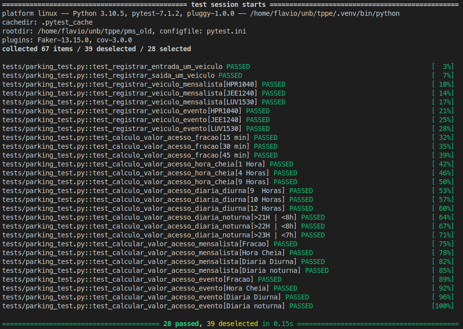
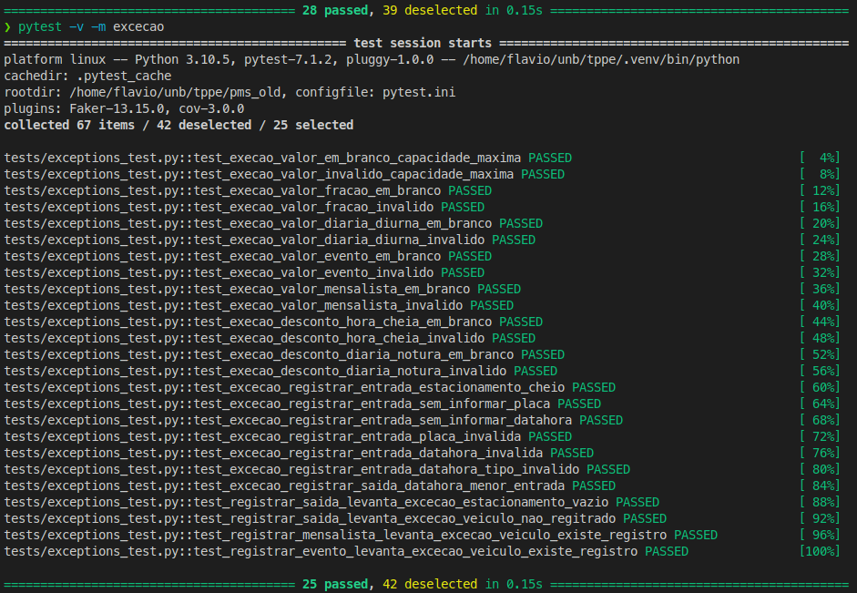
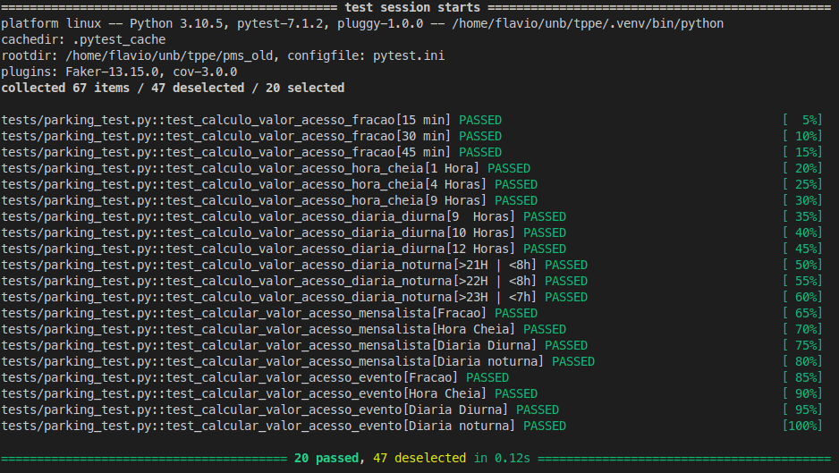

# Sistema de Gerenciamento de Estacionamentos - PMS
---
<br />
<p align="center"> </p>
<br />

---
<br />

> ### 📌 **Visão Geral - Trabalho Prático TDD - TTPE**
O PMS é ums sistema simples e completo de **gerenciamento de estacionamentos particulares e instalações públicas**.

O principal objetivo é informatizar o controle de liberação das catracas eletrônicas e o gerenciamento de diversas formas de acesso aos estacionamentos.
<br /><br />

|Nome|Matrícula|
|---|---|
|Flavio Vieira Leão | 15/0125682|

<br /><br />

### 📋 **Principais Funcionalidades**

* Cadastrar os acessos(entrada/saída) dos veículos no estacionamento;
* Controle financeiro de clientes avulsos, mensalistas e por evento;
* Calculo do valor por tipo de acesso (frações, hora cheia, diária e mensalista);
* Calcular os valores a serem repassados pela gerenciadora de estacionamentos ao contratante.
* Emitir relatórios de mensalistas;
<br /><br />


### 🔧 **Como Rodar o Projeto**
* Clone esse repositório.
* Crie um virtualenv com Python 3.
* Ative o virtualenv.
* Instale as dependências.
* Execute os testes
```
git clone https://github.com/flaviovl/pms
cd pms
python3 -m venv .venv
source .venv/bin/activate
pip install -r requirements.txt
```
<br />

### ⚙️ **Executando os testes**
* Rodar suite testes completa:
```
pytest -svv
```
* **Rodar grupo de teste de entrada de dados:**
```
pytest -svv entrada_dados
```
* **Rodar grupo de testes de exceção:**
```
pytest -svv excecao
```
* **Rodar grupo de testes de funcionais:**
```
pytest -svv funcional
```
* **Rodar grupo de testes de registros de entrada e saida de veiculos:**
```
pytest -svv registro_entrada_saida
```
* **Outros grupos de testes:**
```
pytest -svv estacionamento
pytest -svv valor_acesso
pytest -svv apurado
```
<br />

### 🔩 Imagens dos principais testes

---
* Grupo de testes funcionais:
<br />
<p align="center"> </p>
<br />

---
* Grupo de testes exceção:
<br />
<p align="center"> </p>
<br />

---
* Grupo de testes de valor de acesso:
<br />
<p align="center"> </p>
<br />

### 🛠️ Construído com

* **Python 3.10.2**
<br /><br />

## 📄 Licença

Este projeto está sob a licença MIT - veja o arquivo [LICENSE.md](https://github.com/usuario/projeto/licenca) para detalhes.
