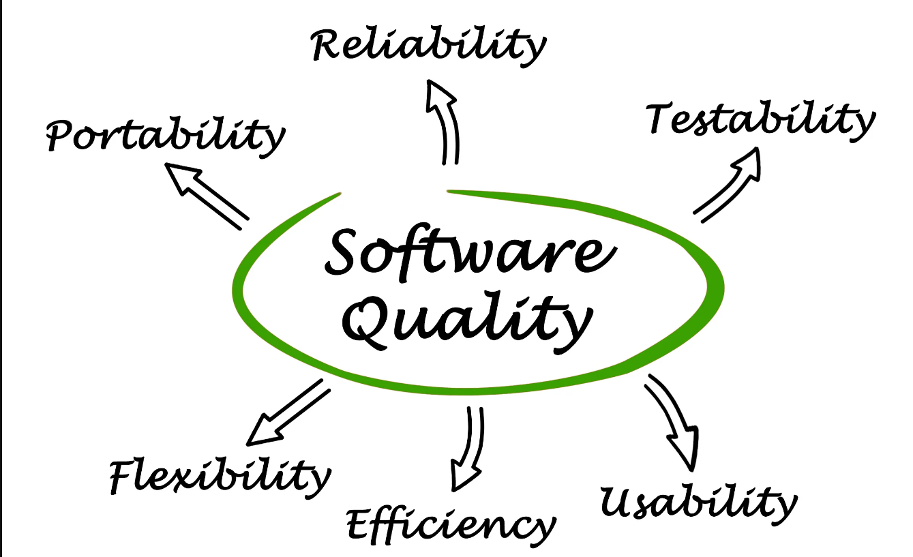

#  Qualidade do projeto de código - TP3 TPPE
---
 

 

 

---
 

> ### 📌 **Simplicidade e elegância:**

Simplicidade e a elegância são dois princípios que na engenharia de software andam de mãos dadas. Projetos se software devem ser tão simples quanto possível. Um código para ser elegante não precisa ser complexo, precisa ser legível, fácil de entender e eficiente.

Simplicidade é também um dos princípios por trás da prática de Extreme Programming (XP) “desenvolva uma solução não apenas que funcione, mas que seja a mais simples possível” ou o famoso “fazer a coisa mais simples que funciona” YAGNI(You Ain’t Gonna Need it).

A vantagem da simplicidade é ainda maior quando a pessoa que mantém o software não é aquela que uma vez o escreveu. Os programas simples são mais fáceis de manter porque o mantenedor necessita de menos tempo para compreendê-los, portanto a probabilidade de ter defeitos a longo prazo é bem menor.
 

**Simplicidade e Elegância são base do Zen do Python, escrito por Tim Peters em 1999.**
"Simples é melhor que complexo";  
"Bonito é melhor que feio";  
"Legibilidade conta";  
"Complexo é melhor que complicado";  
"Se a implementação é difícil de explicar, é uma má ideia."...  

>“Qualquer tolo pode escrever um código que um computador consiga entender. Bons programadores escrevem código que humanos consigam entender.” – Martin Fowler

 
 

  > ### 📌 **Modularidade (baixo acoplamento e alta coesão):**

A modularização é o processo de dividir as funcionalidades de um sistema de software em vários módulos independentes, onde cada módulo contenha tudo o que é necessário para executar a funcionalidade.

 

**Algumas vantagens da Modularização são:**
• Aumenta a Coesão;  
• Reduz o acoplamento;  
• Fácil de entender e manter o sistema;  
• A manutenção do sistema é fácil estender funcionalidades;  
• Um módulo pode ser usado várias vezes(reuso de código);  

**Acoplamento: é a medida do grau de interdependência entre os módulos. Um bom software terá baixa acoplamento.**
Na prática, o acoplamento é uma das causas de complexidade em software. Quanto maior ele for, mais complexo o sistema se torna, pois componentes que são dependentes entre si, normalmente, não podem ser compreendidos, modificados ou corrigidos sem considerar suas dependências.
 

**Coesão: é uma medida do grau em que os elementos do módulo são funcionalmente relacionados. Um bom projeto de software terá alta coesão.**

Um módulo com baixa coesão faz muitas coisas não relacionadas e leva aos seguintes problemas:
• Difícil de entender;  
• Difícil de reusar;  
• Difícil de manter;  
• "Delicado": sendo constantemente afetada por outras mudanças
 
 

> ### 📌 **Extensibilidade:**
Extensibilidade é a capacidade do software de ser estendido ou melhorado em suas funcionalidades. É uma das chaves da orientação a objetos quando um novo comportamento ou funcionalidade precisa ser adicionado, espera-se que o software seja flexível o suficiente para serem estendidas e não alteradas, dessa forma o código original permanece intacto e confiável. Neste escopo está intimamente relacionada com a manutenibilidade e boa qualidade da base de código.

Um software manutenível deve ser fácil adicionar código ao sistema existente, deve ser fácil atualizar para novos recursos. É um código que pode ser entendido até por alguém novo com um mínimo de esforço. 

O Princípio de Aberto/Fechado (OCP) do SOLID torna software mais extensível e facilitando sua evolução sem afetar a qualidade do que já está desenvolvido, é muito comum utilizar o Strategy Pattern do GoF.

Entre os fatores decisivos para o sucesso de um produto de software a extensibilidade é um dos principais e está diretamente ligada manutenibilidade. Pois para um sistema ser extensível, precisa de ser modularizado com alta coesão e baixo acoplamento, boa documentação entre outros.

A manutenibilidade pode ser medida com algumas métricas: numero de linhas de código, medidas de McCab, métricas de complexidade de Halstead, complexidade ciclamática, profundidade de herança dentre outros.
 
 

> ### 📌 **Portabilidade:**
A portabilidade pode ser definida como: “A facilidade com que um sistema ou componente pode ser transferido de um hardware, ou software ambiente para outro”.

A portabilidade do software é um atributo desejável para a qualidade do software. Essa característica é composta das seguintes sub características:

Adaptabilidade- Grau em que um produto ou sistema pode ser adaptado de forma eficaz e eficiente para hardware, software ou outros ambientes operacionais ou de uso diferentes, ou em evolução.

Instabilidade - Grau de eficácia e eficiência com que um produto ou sistema pode ser instalado e/ou desinstalado com sucesso em um ambiente especificado.

Substituibilidade - Grau em que um produto pode substituir outro produto de software especificado para a mesma finalidade no mesmo ambiente.

A Implementação do projeto foi realizada em Python e permite extensões escritas em C e C++ (Cpyton). É um projeto open source portátil que e suportado pelos principais tipos de plataforma, como o Windows, Linux e MacOs, todos de forma nativa. E ainda permite implementações em Jython (interpretador Python em Java). Gera bytecodes compatíveis com a JVM.
